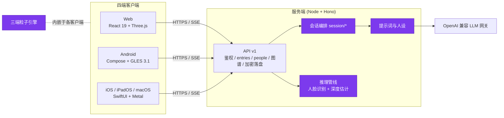

<div align="center">

# 念想 nianxiang

**把日常照片变成粒子星云，和「念念」聊聊照片背后的故事，凝聚成一篇属于你的日记。**

[](LICENSE)


</div>

<!-- TODO: 演示 GIF/截图 —— 用 MOCK_AI=1 pnpm dev 录制,无需任何 API key
<p align="center"></p>
-->

---

## 这是什么

念想是一个自托管的「照片记忆」应用：上传一张照片，它会化作一片可以触摸、旋转、带景深的粒子星云；AI 伙伴「念念」看着照片和你搭话，陪你聊完之后把对话凝聚成一篇日记。日子久了，念念会认得照片里的人、记得你说过的事、沉淀出你的性格印象，语气随之贴近你。

- **粒子星云**：照片粒子化 + 单目深度估计前后景分层，真实视差、景深散景、沙化消散——Web/Android/Apple 三端各自原生实现，行为对齐
- **对话式回忆**：念念以老朋友的口吻开场提问，聊天记录一键凝聚成日记；月末生成月度回顾
- **认人**：人脸检测/识别完全在你自己的服务器本地推理，特征向量不出服务器；自动聚类未命名的脸
- **人物图谱**：从日记中推断人物关系，人工标注优先于 AI 推断
- **家庭共享**：家庭账户邀请成员共享人物库；日记条目严格私有
- **端到端加密落盘**：照片、日记、聊天、人脸特征、人格画像全部密文存储，密钥由用户密码派生——服务器管理者拿到磁盘也读不到内容；忘记密码只能用注册时展示一次的恢复码找回

## 架构



紫色模块属于**私有 core**（见下方「半开源说明」），其余全部开源。

## 技术栈

| 端 | 语言 / 框架 | 关键依赖 |
|---|---|---|
| 服务端 | TypeScript / Hono | onnxruntime-node、sharp，原生 `node --watch` 跑 TS，无打包器 |
| Web | TypeScript / React 19 | Three.js（WebGL 粒子）、Zustand、Dexie、Vite |
| Android | Kotlin / Jetpack Compose | OpenGL ES 3.1 compute shader 粒子、Coil |
| Apple | Swift / SwiftUI | 单一 multiplatform target（iOS/iPadOS/macOS）、Metal 粒子、XcodeGen |

## 快速开始

```bash
pnpm install
cp .env.example .env
# .env 里设置 MOCK_AI=1 即可离线体验完整交互,无需任何 API key
# 建议:JWT_SECRET=$(openssl rand -hex 32)
pnpm dev               # Web :5173  API :8787
```

首次打开 Web 会提示创建首个家庭账户；此后可开放注册家庭/个人账户（可用 `REGISTRATION_CODE` 门控）。服务器重启后需输入密码解锁数据（密钥只存在内存）。

生产部署（单进程托管 `client/dist` + `/api/v1`）：

```bash
pnpm build && pnpm start
# 或 Docker:
docker compose up --build
```

## 半开源说明

本仓库是「念想」的**公开部分**，以 Apache-2.0 发布，克隆即可独立构建运行。产品的差异化核心放在私有子模块 `core/`（nianxiang-core）中，公开构建以桩实现优雅降级：

| 模块 | 状态 | 公开构建下的行为 |
|---|---|---|
| 服务端框架、鉴权、entries/people/图谱 CRUD、家庭体系、加密落盘、管理台 | ✅ 公开 | 完整可用 |
| 三端客户端 UI、状态管理、API 层 | ✅ 公开 | 完整可用 |
| AI 提示词与念念人设（`prompts.ts` / `mock.ts` 文案） | 🔒 私有 core | 占位提示词与占位文案，`MOCK_AI=1` 仍可跑通全部交互 |
| 人脸识别、深度估计推理管线 | 🔒 私有 core | 设 `INFERENCE_DISABLED=1`,该能力对客户端广播为不可用 |
| 会话编排（`session/open·message·complete`） | 🔒 私有 core | 返回 `501 UNAVAILABLE`（标准错误信封） |
| 三端粒子引擎 | 🔒 私有 core | 照片以静态图显示,无粒子/景深动效 |

拥有 core 访问权的开发者：

```bash
git clone --recurse-submodules <this-repo>
./scripts/select-core.sh    # 真实实现覆盖公开桩(git status 保持干净)
pnpm install && pnpm dev    # 完整功能
```

修改核心代码后 `./scripts/select-core.sh --push` 回写并到 `core/` 提交；`--reset` 还原公开桩。推送公开仓库前请跑 `./scripts/check-leaks.sh`。

## API

| 项 | 说明 |
|----|------|
| 文档 | [docs/api-v1.md](docs/api-v1.md) |
| OpenAPI | [server/openapi/v1.yaml](server/openapi/v1.yaml) |
| 基址 | `/api/v1`（旧 `/api/*` 兼容层已移除） |
| 鉴权 | JWT Bearer；bootstrap / login；重启后 `423 E_KEYS_LOCKED` → `auth/unlock` |
| 隔离 | entries 严格按 owner；people/图谱按家庭或个人作用域；跨家庭互不可见 |
| SSE | `{"type":"delta","text"}` / `{"type":"done"}` |

## 安全与加密

- 所有用户内容（照片、缩略图、日记、聊天、人脸特征、深度缓存、人格画像）以 AES-GCM 信封密文落盘，密钥由用户密码经 scrypt 派生，仅存内存
- 家庭共享走密钥包裹（X25519 sealed box），成员退出即轮换家庭密钥并重加密缓存
- 人脸推理完全在自托管服务器本地进行，任何生物特征数据不出服务器
- 管理台（`/ops`）零用户密钥设计：管理员可管账号、备份、审计，但读不到任何用户内容（[docs/ops.md](docs/ops.md)）

> **⚠️ 人脸模型许可**
> 启用人脸功能时,服务端首次启动会从 HuggingFace 自动下载 InsightFace `buffalo_l` 权重（不随本仓库分发）。该权重**仅授权非商业研究用途**。商业部署必须自行替换为有商用授权的权重,或保持 `INFERENCE_DISABLED=1` 关闭人脸功能。深度模型 Depth Anything V2（Apache-2.0）无此限制。详见 [NOTICE](NOTICE)。

## 各端构建

**Android**（[docs/android.md](docs/android.md)）：

```bash
cd android && ./gradlew :app:assembleDebug
# app/build/outputs/apk/debug/app-debug.apk
```

**Apple**（[docs/apple.md](docs/apple.md)）——iOS / iPadOS / macOS 单一 target；仓库中 `DEVELOPMENT_TEAM` 留空，真机构建需自行填写：

```bash
cd apple && xcodegen generate
xcodebuild -project Nianxiang.xcodeproj -scheme Nianxiang -destination 'platform=macOS' build
```

部署穿透 / HTTPS 见 [docs/deploy-tunnel.md](docs/deploy-tunnel.md)，验收清单见 [docs/e2e-checklist.md](docs/e2e-checklist.md)。

## License

代码以 [Apache-2.0](LICENSE) 发布；第三方模型许可见 [NOTICE](NOTICE)。`core/` 私有子模块保留所有权利。
